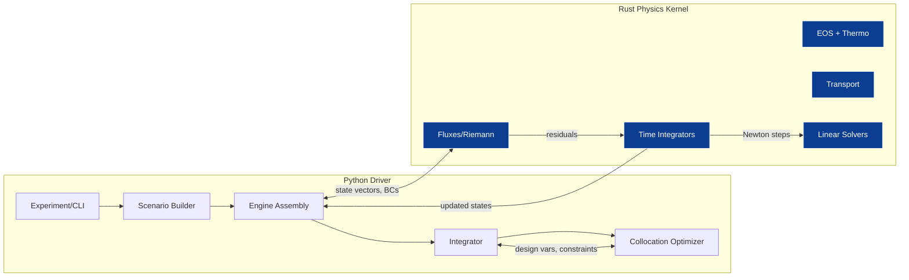
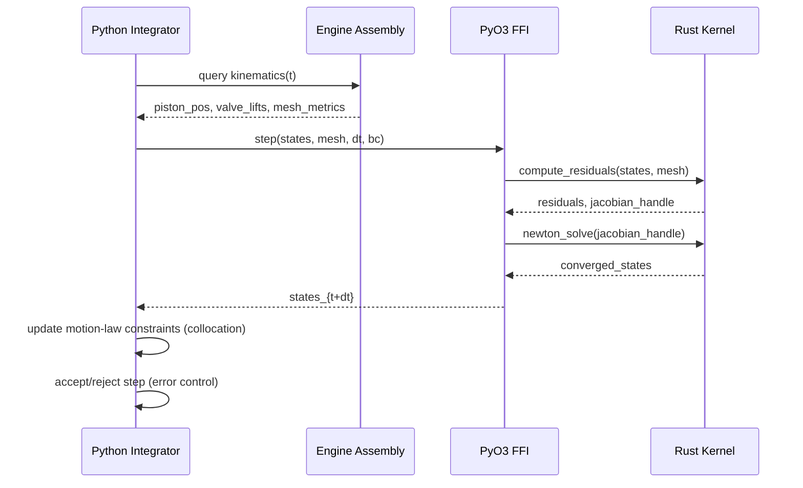

## OP Engine Physics Kernel: Python/Rust Hybrid Architecture (Draft)

Status: draft

Scope: High-fidelity, multi-layer engine simulation for a non-ideal working gas in an opposed-piston (OP) engine with an ideal, free piston motion-law solver. This draft specifies the module layout, runtime dataflow, interfaces, and optimization coupling needed to evolve toward production quality.

---

### Objectives

- Encode conservation laws and thermodynamics with extensible model fidelity (0D/1D/3D hooks)
- Provide robust time-integration and solver interfaces (implicit/explicit)
- Support a non-ideal EOS and temperature-dependent transport
- Couple gas dynamics to a free-piston motion law via collocation/optimal control
- Expose a stable Python API for experiments, sweeps, and optimization

---

### Layered Architecture

Three-layer design mapping to code layout. New/migrated code lives under `campro/` per repo rules; root `CamPro_*.py` are compatibility stubs.

```
campro/
  core/               # Core physics & numerics (Rust-backed, Python façade)
    thermo/           # EOS, Cp(T), gamma(T), real-gas tables
    transport/        # μ(T,p,Y), k(T,p,Y), Pr correlations
    fluid/            # fluxes, Riemann solvers, boundary conditions
    chemistry/        # mechanism loader, source terms (optional phase 2)
    numerics/         # time stepping, Newton-Krylov, linear solvers
    mesh/             # 0D control volume, 1D pipes, ALE hooks
  engine/
    geometry/         # cylinder/ports/manifolds
    moving_boundaries/# piston/valve kinematics, ALE coupling
    coupling/         # gas-structure-thermal couplers
    combustion/       # Wiebe, multi-zone, detailed kinetics adapters
  optimize/
    collocation/      # CasADi/Pyomo collocation, motion-law constraints
    adjoint/          # sensitivities (phase 2+)
    surrogate/        # ML surrogates for acceleration
  io/
    config/           # YAML/JSON schemas, validation
    results/          # structured outputs, HDF5/parquet
  logging.py          # uses campro.logging.get_logger

rust/
  crates/
    physics-kernel/   # Core solvers, EOS, transport (no Python deps)
    ffi-pyo3/         # PyO3 bindings; built as python extension via maturin
```

---

### Component Diagram (runtime)



---

### Sequence: Single Time Step with Free-Piston Coupling



---

### Public Python API (façade)

High-level, typed interfaces. All modules use `from campro.logging import get_logger; log = get_logger(__name__)`.

```
campro/core/api.py
  - class ThermoModel: eos(state) -> pressures, gammas
  - class TransportModel: viscosity(state), conductivity(state)
  - class FluidSolver: step(state, mesh, bc, dt) -> state
  - class Integrator: advance(system, t0, t1, tol) -> Trajectory

campro/engine/assembly.py
  - class OPEngine: build(config) -> EngineSystem
  - class MotionLaw: kinematics(t, params) -> x, v, a

campro/optimize/collocation/driver.py
  - solve_motion_law(engine, bounds, initial_guess) -> OptimalParams
```

All public classes/functions must include type hints (`mypy --strict`) and rely on shared constants via `campro.constants` for duplicate literals.

---

### Rust Core: Crates and FFI

- `physics-kernel` crate
  - EOS: ideal, Peng–Robinson/Soave, tabulated real-gas (NIST tables optional)
  - Transport: Sutherland or Chung correlations with mixture rules
  - Fluxes: Rusanov/HLLC; extendable to AUSM/roe
  - Integrators: SDIRK(2), BDF(1-2), RK(3-4) with adaptive control
  - Linear Solvers: GMRES/BiCGStab with ILU/physics preconditioners

- `ffi-pyo3` crate
  - `#[pyclass]` state containers using SoA buffers (f64)
  - Zero-copy ndarray views when possible; otherwise explicit copy with stride checks
  - Built via `maturin` to a manylinux/macos universal wheel

---

### Data Models and Units

- State vector per cell: `[rho, rho*u, rho*v, rho*w, rho*E, rho*Y[...]]`
- Thermo composition: `Y_i` mass fractions; sum to 1 within tolerance
- Units: SI; assert at boundaries; conversion utilities at I/O only
- Precision: float64 everywhere at solver boundaries

---

### Motion Law and Collocation

- Collocation (CasADi) defines free-piston kinematic constraints: \(x(t), v(t), a(t)\)
- Design variables: spring rate equivalent, damping, phasing, initial state
- Objective: e.g., IMEP maximization subject to peak pressure/knock surrogates
- Constraints link gas pressure force to piston dynamics in each collocation interval

```mermaid
flowchart TB
  P[Design vars] --> G[Gas Solver Trajectory]
  G --> C[Collocation Defects]
  C --> S[Solver (IPOPT)]
  S -->|gradients via AD/finite-diff wrappers| P
```

Gradient Paths:
- Primary: Python AD (CasADi) wrapping differentiable Python façades with taped FFI calls
- Secondary: Finite-difference with step-size control and parallel batches
- Future: Reverse-mode adjoint in Rust for gas dynamics

---

### Fidelity Modes

- 0D mode (default): Single control volume; uniform T,p; rapid prototyping
- 1D mode: Unsteady gas dynamics in ports/pipes; simple ALE for piston
- 3D hook: Boundary-exchange interface for external CFD (pressure/enthalpy coupling)

Mode selection is declarative via `io/config` schemas.

---

### Testing & Verification

- Tests live in `tests/` as `test_*.py` (pytest + hypothesis)
- Required baseline problems:
  - Shock tube (Sod/SG) for flux/integrator checks
  - Adiabatic, reversible expansion (analytic reference)
  - 0D constant-volume ignition (when chemistry enabled)
  - Mechanism-free regression: energy conservation and monotonic entropy checks
- CI gates: `ruff --fix`, `mypy --strict`, `pytest -q`; no bare `print(` outside tests

---

### Logging

- All modules acquire logger via `campro.logging.get_logger`. No custom handlers; default INFO level. GUI-specific handlers remain isolated in GUI layer.

---

### Milestones

1. 0D thermodynamic box with ideal/real-gas EOS in Rust + Python façade
2. Integrator with adaptive RK/SDIRK and error control; piston kinematics coupling
3. Collocation driver for motion-law optimization (CasADi + IPOPT)
4. 1D unsteady ports with simple turbulence and wall heat transfer correlations
5. Chemistry plug-in with reduced mechanisms; UQ hooks and surrogates

---

### Notes

- Duplicate literals shared across modules must be hoisted to `campro.constants`.
- All public APIs are typed; avoid `Any`. Maintain acyclic dependencies between feature modules.


